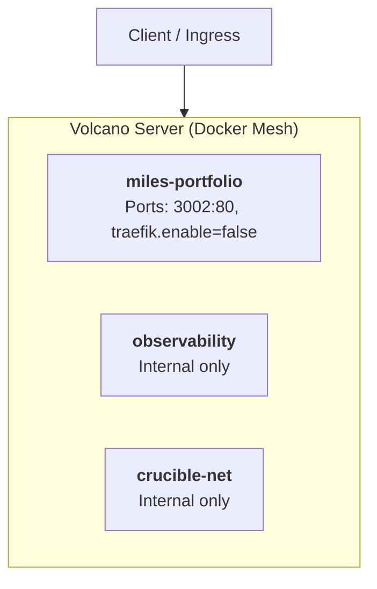

# Miles Hillary Portfolio Architecture & Topology

> *Auto-generated on every push via GitHub Actions. Do not edit manually.*  
> **Last Generated:** 2026-09-22 11:33:42 UTC

## Service Mesh Overview

---

## Container Specifications

| Container Name | Service Name | Mapped Ports | Volumes | Memory Limit |
| :--- | :--- | :--- | :--- | :--- |
| `miles-portfolio` | `portfolio` | `3002:80, traefik.enable=false` | `"3002:80"` | `unlimited` |
| `observability` | `observability` | `None` | `None` | `unlimited` |
| `crucible-net` | `crucible-net` | `None` | `None` | `unlimited` |
